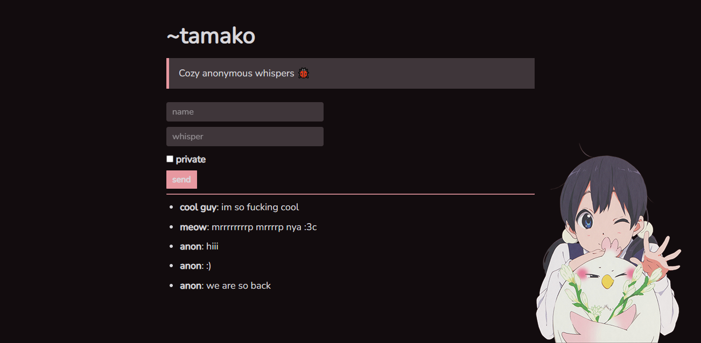

# tamako🐞

> Cozy anonymous whispers!

# note ⚠️

tamako is currently a work-in-progress (WIP) and is **extremely** unpolished. everything is unstable, implemented quick-and-dirty and **very** subject to change.

# todo

- [x] implement api endpoints
  - [x] add whisper `POST @ /api/whisper`
  - [x] list whispers `GET @ /api/whispers`
  - [ ] delete whisper/s (requires auth) `DELETE @ /api/whispers/:snowflake`
- [x] limit payload to prevent spam
- [x] web frontend (literal hell)
  - [x] basic skeleton
  - [x] actual functionality
- [ ] cleanup code
  - [ ] backend
  - [ ] frontend
- [ ] implement ratelimit
- [ ] implement auth for private whispers
  - [ ] /auth to login
  - [ ] `POST @ /api/auth` post password, recieve hash, save hash as token in local storage
  - [ ] include token in headers
  - [ ] validate token and return private whispers
- [x] optional non-anonymous whispers
- [ ] simple cli utility
- [ ] discord webhook support
- [ ] dockerize

## license

[OSL-3.0](LICENSE)
